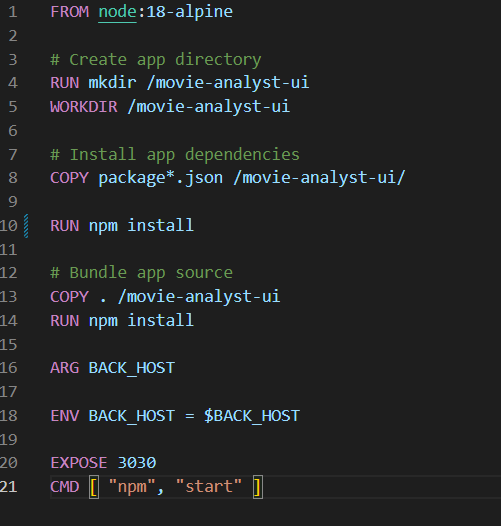

# Download the Movie Analyst repos and add Dockerfiles.

Fork the repository in Github.

Clone the repository in you local machine. 

$ git clone <\repository_url>

Create a Dockerfile with the specifications of the application.

Build the dockerfile.

$ docker build -t daramirezs/movie-analyst-ui:1.0 -t daramirezs/movie-analyst-ui:latest .

$ 
# Run synchronously ensuring that the API is responding to all the UI requests.

# Upload both images to any container Registry such as Docker Hub 