# Requirements

* Install [docker](https://docs.docker.com/engine/install/)

* Dockerhub account

# Pull a Redis image from Docker Hub and make it run.

1. Search docker image to pull in docker hub (redis)

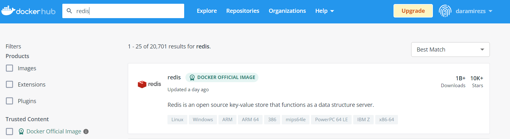

2. Pull redis image

$ docker pull redis: <\version>

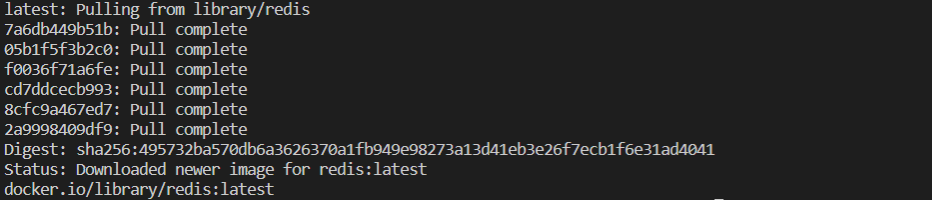

If we list our docker images: 

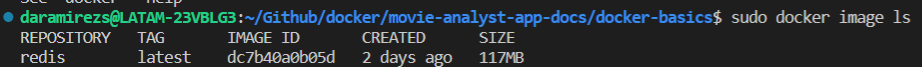

Now, to run our docker in second plane just:

$ docker run -d redis 

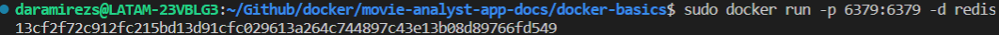

# Connect to the Redis CLI from your host.

To connect our terminal with the docker container: 

$ docker exec -it <\container_id> /bin/bash

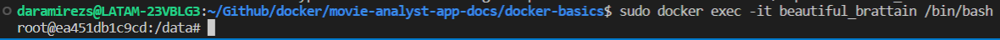

Now, we can run commands in our redis container:

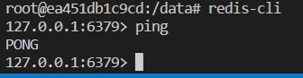

# Show logs from a running container.

To save the log of our container:

$ docker logs <\container_id> >> myredis.log

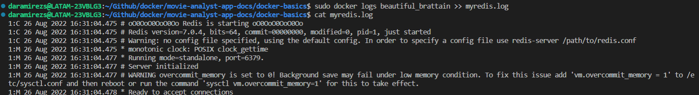

# Create a custom image from a running container.

1. create temporal file to modify our running container:

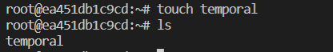

2. Create an image from the container:

$ docker commit <\container_name>

Now look at the docker images list:

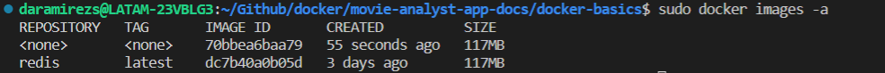  

3. Tag the image: 

$ docker tag <\image_id> <\SOURCE_IMAGE><:><\tag>

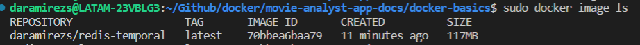  

4. Push the image:

$ docker push <\image_name>

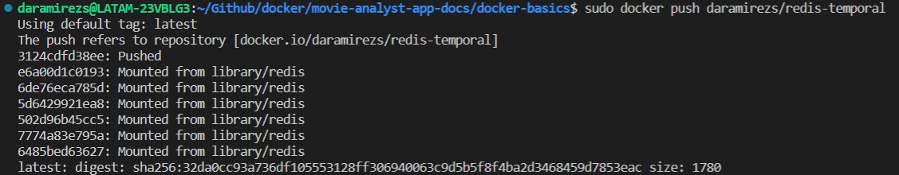  

Image in dockerhub:

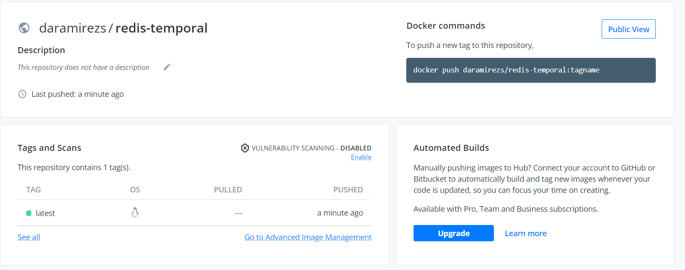  